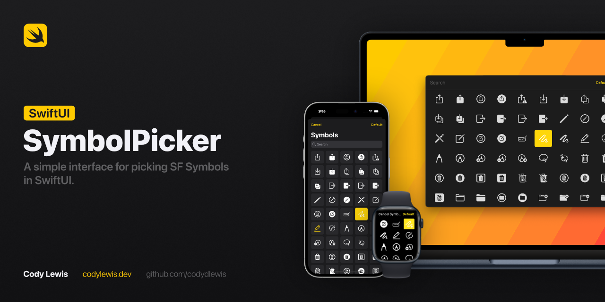

# SymbolPicker


A simple interface for picking SF Symbols in SwiftUI.



## Features

- Simple to use out-of-the-box. Simply import the package, and use the `SymbolPicker` view (see examples below).
- All SF Symbols (v4) available to be used.
- Specify a default symbol to give users a quick select button.
- Filter symbols using the search field.

## Usage

### Requirements

Please note, this package *may* work on previous versions of the following technologies; however, there is no consideration made to support versions earlier than stated below (breaking change may be made at any time).

- iOS 16.0+, watchOS 9.0+, macOS 13.0+, tvOS 16.0+
- Xcode 14.0+
- Swift 5.0+

### Installation

This package can be installed either through the Xcode GUI, or you can add it manually to your Package.swift file:

``` swift
dependencies: [
    .package(url: "https://github.com/codydlewis/SymbolPicker.git", .upToNextMajor(from: "1.0.0"))
]
```

### Examples

It is recommended to use `SymbolPicker` within a `sheet`.

``` swift
import SwiftUI
import SymbolPicker

struct ContentView: View {
    @State private var symbol = "folder"
    @State private var showSymbolPicker = false

    var body: some View {
        Button {
            showSymbolPicker.toggle()
        } label: {
            Label("Select symbol", systemImage: symbol)
        }
        .sheet(isPresented: $showSymbolPicker) {
            SymbolPicker(symbol: $symbol, defaultSymbol: "folder")
        }
    }
}
```

You can also create a custom `SymbolGroup` and pass that into the view to show a customised subset of symbols.

``` swift
import SwiftUI
import SymbolPicker

let DocsGroup = SymbolGroup("Documents", symbols: [
    "doc", "doc.fill", "doc.circle", "doc.circle.fill", "doc.badge.plus", "doc.fill.badge.plus",
    "doc.badge.arrow.up", "doc.badge.arrow.up.fill", "doc.badge.ellipsis", "doc.fill.badge.ellipsis",
    "doc.badge.gearshape", "doc.badge.gearshape.fill", "lock.doc", "lock.doc.fill", "arrow.up.doc",
    "arrow.up.doc.fill", "arrow.down.doc", "arrow.down.doc.fill", "doc.text", "doc.text.fill",
    "doc.zipper", "doc.on.doc", "doc.on.doc.fill", "doc.on.clipboard", "arrow.right.doc.on.clipboard",
    "arrow.up.doc.on.clipboard", "arrow.triangle.2.circlepath.doc.on.clipboard", "doc.on.clipboard.fill",
    "clipboard", "clipboard.fill", "list.bullet.clipboard", "list.bullet.clipboard.fill",
    "list.clipboard", "list.clipboard.fill", "doc.richtext", "doc.richtext.fill", "doc.plaintext",
    "doc.plaintext.fill", "doc.append", "doc.append.fill", "doc.text.below.ecg",
    "doc.text.below.ecg.fill", "chart.bar.doc.horizontal", "chart.bar.doc.horizontal.fill",
    "list.bullet.rectangle.portrait", "list.bullet.rectangle.portrait.fill", "doc.text.magnifyingglass",
])

struct ContentView: View {
    @State private var symbol = "doc"
    @State private var showSymbolPicker = false

    var body: some View {
        Button {
            showSymbolPicker.toggle()
        } label: {
            Label("Select symbol", systemImage: symbol)
        }
        .sheet(isPresented: $showSymbolPicker) {
            SymbolPicker(symbol: $symbol, defaultSymbol: "doc", symbolGroup: DocsGroup)
        }
    }
}
```

## Todo

The following is a list of things I would *like* to do at some point.

- [x] Optional default symbol with quick access button
- [x] Support multiplatform usage (watchOS, macOS, tvOS)
- [ ] Make backwards compatible with previous OS versions
- [ ] Show and navigate between different 'categories' of symbols
- [ ] Filter options for showing only one type of symbol 'variant' (e.g., only 'fill' or only 'circle' variants)
- [ ] Improve search method to allow for spaces (in place of full stops) and ignores word order
- [ ] Support making group selections (i.e., select multiple symbols, not just one)

## License

This package is available under the MIT license. See the [LICENSE](LICENSE) file for more information.
